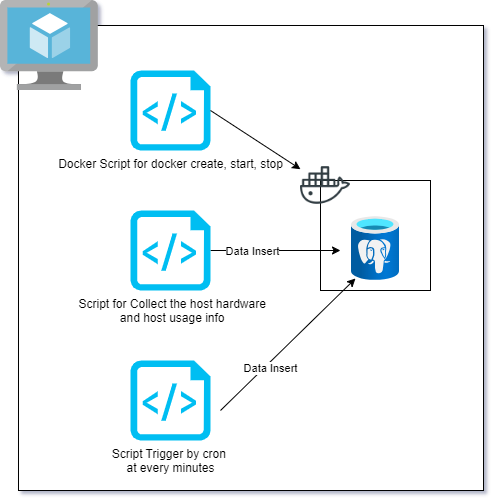

# Linux Cluster Monitoring Agent
## Introduction
This project is a Linux-based monitoring agent designed to collect real-time hardware specifications and node resources. It encapsulates the monitoring process using Docker for isolation and persistence, ensuring seamless data collection and storage. The gathered data is stored in a PostgreSQL (PSQL) database for efficient retrieval and analysis.
The primary users of this project are system administrators and IT professionals who need to monitor and manage Linux-based systems effectively. Technologies used in this project include Linux, Bash scripting for automation, Docker for containerization, PostgreSQL for database management, and Git for version control. This combination of tools ensures a robust, scalable, and efficient monitoring solution.

# Quick Start
- **Start a psql instance using psql_docker.sh**
  ./psql_docker.sh start
- **Create tables using ddl.sql**
  psql -h localhost -U postgres -d host_agent -f ddl.sql
- **Insert hardware specs data into the DB using host_info.sh**
  ./host_info.sh
- **Insert hardware usage data into the DB using host_usage.sh**
  ./host_usage.sh
- **Crontab setup**
  crontab -e
# Implemenation
The implementation of this project began with creating a virtual machine hosted on Google Cloud, accessible via Real VNC Viewer. To meet the project requirements, various Linux commands were employed to collect node information such as CPU and memory usage. Docker was then installed on the virtual machine to manage the PSQL database container, which stores the collected data in a structured format. Automation of the data collection process was achieved using crontab, which runs the monitoring script every minute, ensuring up-to-date information is consistently gathered and stored. This setup guarantees efficient monitoring and data management for Linux-based systems.

## Architecture

## Scripts
Shell script description and usage
- **psql_docker.sh** :
  The psql_docker.sh script is responsible for managing the PostgreSQL Docker container. It runs in following three modes.
    * **"create"** mode: It will require two another parameters to create container. It checks if container exists, if it does, it will print output message and exit, otherwise a new container will be created.
        ```shell
        cd ./scripts/psql_docker.sh create db_name db_password
        ```
    * **"start"** mode: This script makes sure that the docker container is running. To use this script run the following command.
         ```shell
         cd ./scripts/psql_docker.sh start
         ```
    * **"stop"** mode: This script makes sure that the docker container is not running. To use this script run the following command.
        ```shell
        cd ./scripts/psql_docker.sh stop
         ```
- **host_info.sh** :
  The host_info.sh script is responsible for collecting hardware specifications and node resource information. This script gathers data such as CPU and memory usage, which is then stored in the PostgreSQL database.To use this script run the following command.
  ```shell
  cd ./scripts/host_info.sh 
  ```
- **host_usage.sh**:
  The host_usage.sh script collects real-time usage statistics of the host system, such as CPU and memory usage. This data is also stored in the PostgreSQL database for monitoring purposes. To use this script run the following command.
    ```shell
    cd ./scripts/host_usage.sh 
    ```
- **crontab**:
  The host_usage.sh script collects real-time usage statistics of the host system, such as CPU and memory usage. This data is also stored in the PostgreSQL database for monitoring purposes.
  To setup a new crontab, run the following command
  ```shell
      crontab -e
  ```
  To automate the host_usage.sh file, add the following command in the crontab editor.
  ```shell
  * * * * bash /home/rocky/jarvis_data_eng_AmneetAmneet/linux_sql/scripts/host_usage.sh localhost 5432 host_agent postgres postgres > /tmp/host_usage.log
  ```
- **ddl.sql** :
  The ddl.sql file contains SQL queries to create schema, required by above scripts to insert data.


## Database Modeling

## `host_info`
| Column | Data Type | Description                     |
|-----|---------|---------------------------------|
| id | SERIAL  | Primary key for the table       |
| hostname   | VARCHAR | Name of the host                |
| cpu_number | INT2    | Number of CPUs                  |
| cpu_architecture | VARCHAR | Architecture of the CPU         |
| cpu_model| VARCHAR | Model of the CPU                |
| cpu_mhz| FLOAT8  | Speed of the CPU in megahertz   |
| l2_cache | INT4    | Level 2 cache size in kilobytes |
| total_mem | INT4    | Total memory in KB              |
| timestamp | TIMESTAMP | Current time in UTC time zone   |

## `host_usage`
| Column | Data Type | Description                       |
|-----|-----------|-----------------------------------|
| id | SERIAL    | Host id from host_info table      |
| hostname   | VARCHAR   | Name of the host                  |
| memory_free | INT4      | Free memory in megabytes          |
| cpu_idle | INT2      | Percentage of CPU idle time       |
| cpu_kernel| INT2      | Percentage of CPU kernel time     |
| disk_io| INT4      | Number of disk I/O                |
| disk_available | INT4      | Available disk space in megabytes |
| timestamp | TIMESTAMP | Current time in UTC time zone     |

# Test
1. **Review Script Syntax**: Ensured that the DDL commands in the bash scripts (psql_docker.sh and queries.sql) were correctly formatted and free of syntax errors.
2. **Execute Scripts Locally**: Ran the bash scripts (psql_docker.sh) and SQL script (queries.sql) locally on a Linux environment to create the tables and perform DDL operations
3. **Verify Table Creation**: Checked the PostgreSQL database to confirm that the tables (host_info and host_usage) were successfully created with the expected schema.
4. **Review Logs/Error Messages**: Checked for any error messages or logs generated during script execution to identify and address any issues encountered.

The result of the testing was successful, as the tables were created without errors, and sample data was successfully inserted.

# Deployment
1. **Version Control with Git**: The source code of the project was maintained using Git, with a repository hosted on GitHub. This ensured version control and collaboration among team members.
2. **Containerization with Docker**: The monitoring agent and PostgreSQL database were containerized using Docker. Docker images were built for both the monitoring agent and the PostgreSQL database, ensuring consistency and portability across different environments.
3. **Crontab for Automation**: The execution of the monitoring scripts (host_info.sh and host_usage.sh) was automated using crontab. Scheduled tasks were configured to run the scripts at regular intervals, ensuring continuous data collection and monitoring.
4. **Google Cloud Platform (GCP)**: A virtual machine instance was created on Google Cloud Platform (GCP) to host the Docker containers. The GCP environment provided scalability and reliability for hosting the monitoring agent and database.
5. **Real VNC Viewer for Access**: Real VNC Viewer was used to access the virtual machine instance on GCP, providing a graphical interface for managing and monitoring the deployed application.

# Improvements
* **Enhanced Error Handling**: Implement more robust error handling mechanisms within the bash scripts to gracefully handle unexpected scenarios such as network failures, database connection issues, or disk space constraints. This would improve the reliability and resilience of the monitoring agent.
* **Optimized Data Storage**: Explore strategies to optimize data storage and management within the PostgreSQL database, such as  implementing indexing for faster queries, or archiving historical data to reduce storage overhead.
* **Scalability and Performance**: Investigate ways to enhance the scalability and performance of the monitoring agent, particularly in scenarios with a large number of monitored hosts. This could involve optimizing resource usage, parallelizing data collection tasks, or implementing distributed computing techniques.
